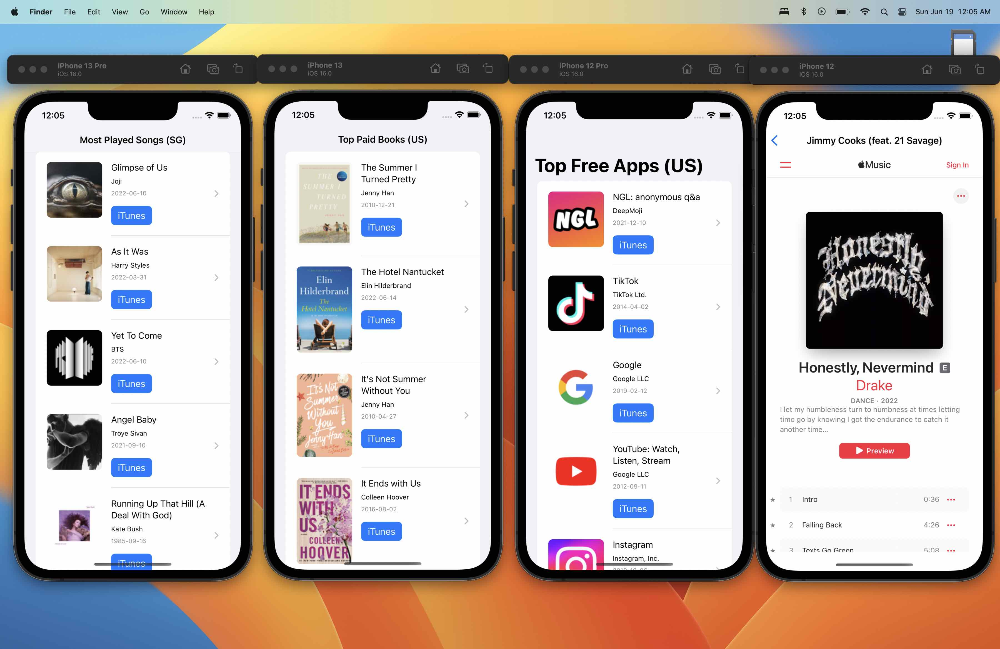

# ITunesFeedSwiftUI



This library provides SwiftUI Views and ObservableObject for fetching iTunes Feed using [ITunesFeedGenerator library](https://github.com/alfianlosari/TunesFeedGenerator)

## Features
- Displays song/book/app in a List/Grid using `MediaListItemView`.
- Displays song/book/app in an embedded webview using `MediaDetailView`.
- Provides Observable Objects to fetch song/book/app.  

## Installation

A detailed guide for installation can be found in Installation Guide. Make sure you use iOS 16, macOS 13 Ventura as target deployment for your app.

### Swift Package Manager

- File > Swift Packages > Add Package Dependency
- Add https://github.com/alfianlosari/ITunesFeedSwiftUI.git
- Select "Main" branch

## Example

### Displays 25 Most Played Songs Feed from Singapore in a List

```swift
struct SongsFeed: View {
    
    @StateObject var vm = SongListObservableObject(region: "sg", resultLimit: .limit25)
    
    var body: some View {
        List(vm.results ?? []) { 
            MediaListItemView(song: $0)
        }.overlay(overlayView)
            .navigationTitle("Most Played Songs (SG)")
            .task {
                if vm.results == nil {
                    vm.fetchMedia()
                }
            }
    }
}
```

### Displays 50 Top Paid Books Feed from US in a List

```swift
struct BooksFeed: View {
    
    @StateObject var vm = BookListObservableObject(region: "sg", resultLimit: .limit50, pricingType: .paid)
    
    var body: some View {
        List(vm.results ?? []) { 
            MediaListItemView(book: $0)
        }.overlay(overlayView)
            .navigationTitle("Top Paid Books (US)")
            .task {
                if vm.results == nil {
                    vm.fetchMedia()
                }
            }
    }
}
```

### Displays 50 Top Free Apps Feed from US in a List

```swift
struct BooksFeed: View {
    
    @StateObject var vm = AppListObservableObject(region: "sg", resultLimit: .limit50, pricingType: .free)
    
    var body: some View {
        List(vm.results ?? []) { 
            MediaListItemView(app: $0)
        }.overlay(overlayView)
            .navigationTitle("Top Free Apps (US)")
            .task {
                if vm.results == nil {
                    vm.fetchMedia()
                }
            }
    }
}
```

### Handle Loading/Failure/Empty cases

You can access the phase enum. It contains 3 cases each for `success`, `failure`, and `loading`. The example below declare an overlayView that can be passed to `overlay` modifier in View.

```swift
@ViewBuilder
private var overlayView: some View {
    switch songsVM.phase {
    case .success(let feed) where feed.results.isEmpty:
        Text("Feed is empty")
    case .failure(let error):
        Text(error.localizedDescription)
    case .loading:
        ProgressView()
    default: EmptyView()
    }
}
```

### Displays song iTunes detail web Page in WKWebView

```swift
MediaDetailView(song: song)
```


### Supported Region Code Strings

You can get the list of all supported region code parameters from this [GitHub Gist](https://gist.github.com/daFish/5990634). Kudos to [Marcus Stöhr/daFish](https://gist.github.com/daFish)
